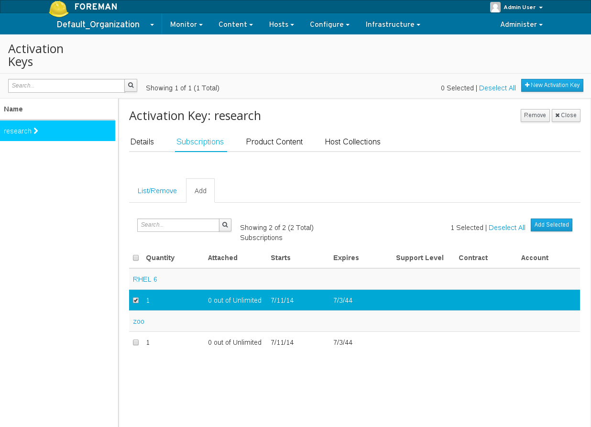

# Activation Keys

Activation Keys provide a mechanism to define properties that may be applied to Content Hosts during registration.  This includes properties such as:

- Lifecycle Environment
- Content View
- Subscriptions
- Repository Enablement
- Host Collections

## Definitions

- [Content Host](../content_hosts/index.html#what-are-content-hosts)
- Host Collection - A statically defined group of Content Hosts.
- Subscription - The right to receive the associated content from Katello.

## General Features

The following is a high-level summary of the Activation Key features:

- [Create an Activation Key](#create-an-activation-key)
- [Add subscriptions to an Activation Key](#add-subscriptions-to-an-activation-key)
- [Change repository enablement for an Activation Key](#change-repository-enablement-for-an-activation-key)
- [Add Host Collections to an Activation Key](#add-host-collections-to-an-activation-key)
- [Register a Content Host using an Activation Key](#register-a-content-host-using-an-activation-key)

## Create an Activation Key

To create a new key,

- navigate to: Content > Activation Keys
- click **New Activation Key**

Note the following option:

- *Content Host Limit*: This option will control how many Content Hosts may be registered using the key.

## Add Subscriptions to an Activation Key

To add subscriptions to a key:

- navigate to: Content > Activation Keys
- select the desired key from the list
- click **Subscriptions**
- click **Add**
- select the Subscriptions you would like to add
- click **Add Selected**

## Change Repository Enablement for an Activation Key

To change repository enablement settings using a key:

- navigate to: Content > Activation Keys
- select the desired key from the list
- click **Product Content**
- click the edit icon for the repository content set that you would like to modify
- select the desired value (e.g. 'Override to Yes', 'Override to No', 'Defaults to Yes', 'Defaults to No')
- click **Save**

View current settings:

Change current settings:

## Add Host Collections to an Activation Key

To add Host Collections to a key:

- navigate to: Content > Activation Keys
- select the desired key from the list
- click **Host Collections**
- click **Add**
- select the Host Collections you would like to add
- click **Add Selected**

## Register a Content Host using an Activation Key

[Click here for more information](../content_hosts/index.html#how-is-a-content-host-registered)
