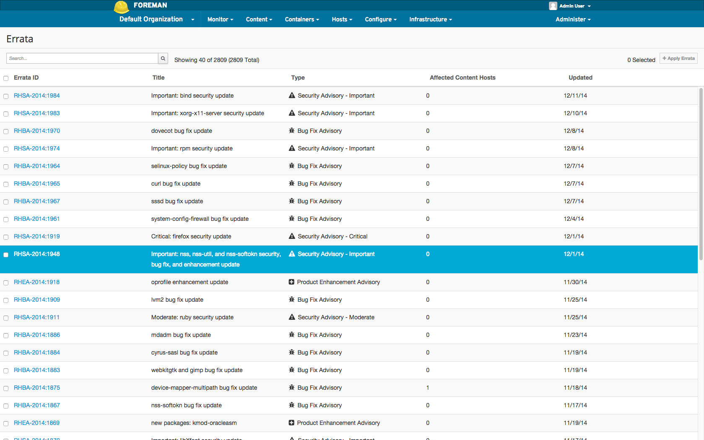
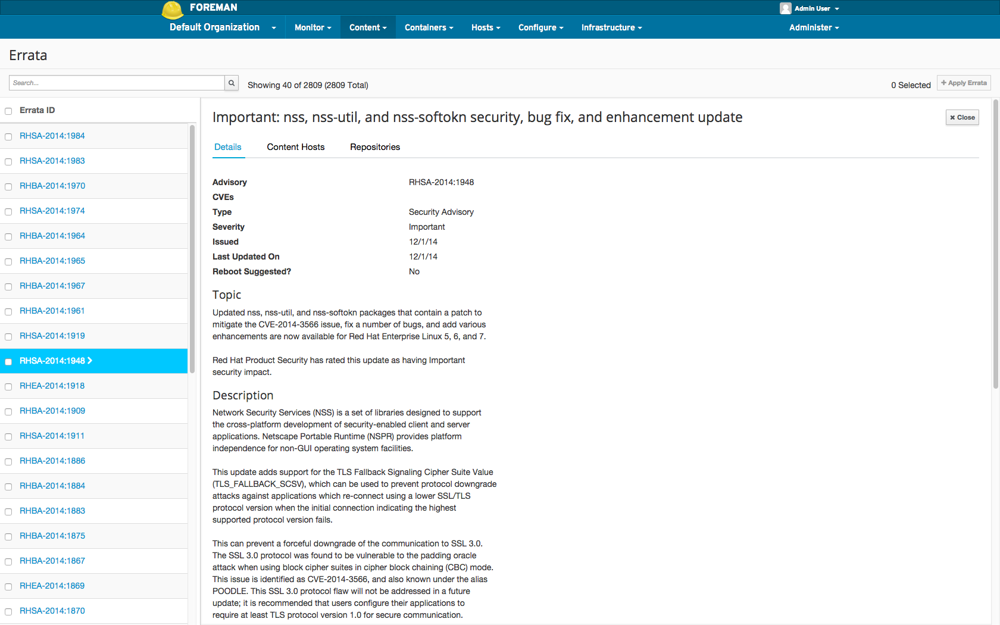
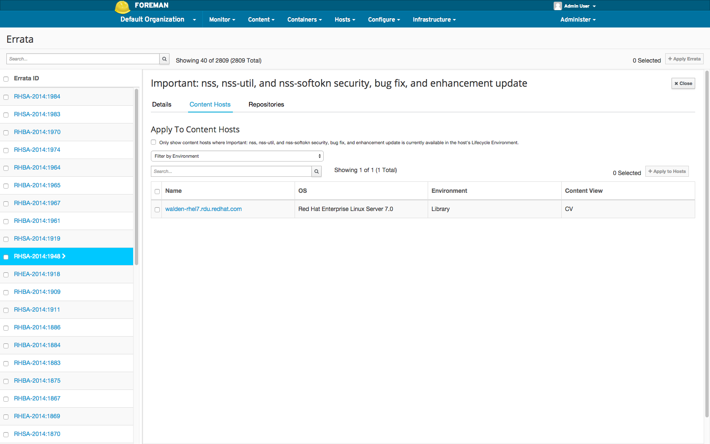
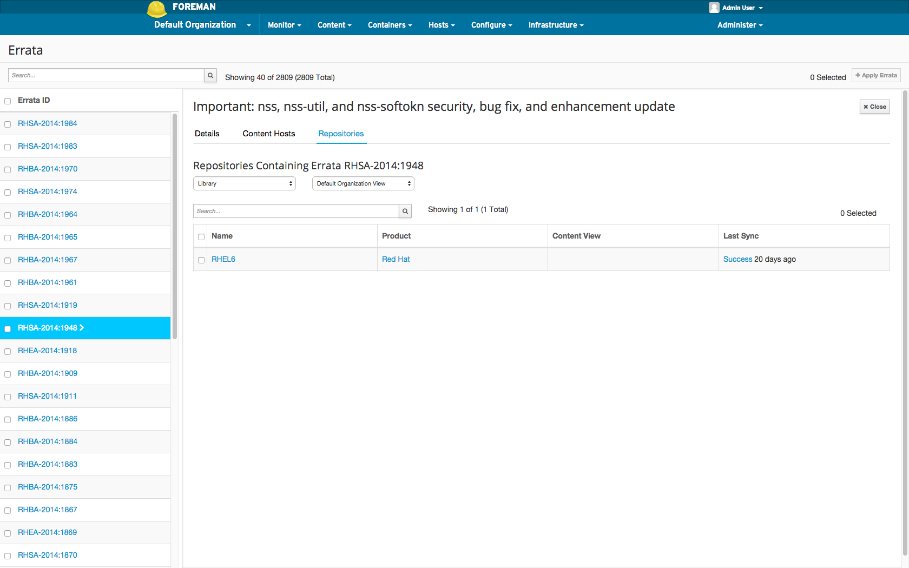

# Errata

Errata are incremental updates between major releases.  An Erratum is metadata about a group of packages that explains the importance of the package updates.
Errata may be released individually on an as-needed basis or aggregated as a minor release.  There are three main types of errata:

- Enhancement:  the new packages contain one or more added features
- Bugfix: the new packages contain one or more bug fixes
- Security:  the new packages fix one or more security vulnerabilities

## Definitions

- [Content Host](../content_hosts/index.html#what-are-content-hosts)
- [Lifecycle Environments](../lifecycle_environments/environment.html)

## General Features

The following is a high-level summary of the Errata features:

- [View List of Errata](#view-list-of-errata)
- [View Errata Details](#view-errata-details)
- [View Affected Content Hosts](#view-affected-content-hosts)
- [View Repositories Containing Errata](#view-repositories-containing-errata)

## View List of Errata

To view the list of Errata in the Organization:

- navigate to: Content > Errata

## View Errata Details

To view the details of an Errata:

- navigate to: Content > Errata
- Click on an Errata ID

## View Affected Content Hosts

To view the Affected Content Hosts of an Errata:

- navigate to: Content > Errata
- Click on an Errata ID
- Click on the Content Hosts Tab

Note the following option:

- Checking the box limits the display of Content Hosts to those which already have the Errata available in their Lifecycle Environment and Content View.

## View Repositories Containing Errata

To view the Repositories Containing an Errata:

- navigate to: Content > Errata
- Click on an Errata ID
- Click on the Repositories Tab

Note that you can filter by Lifecycle Environment and Content View.

