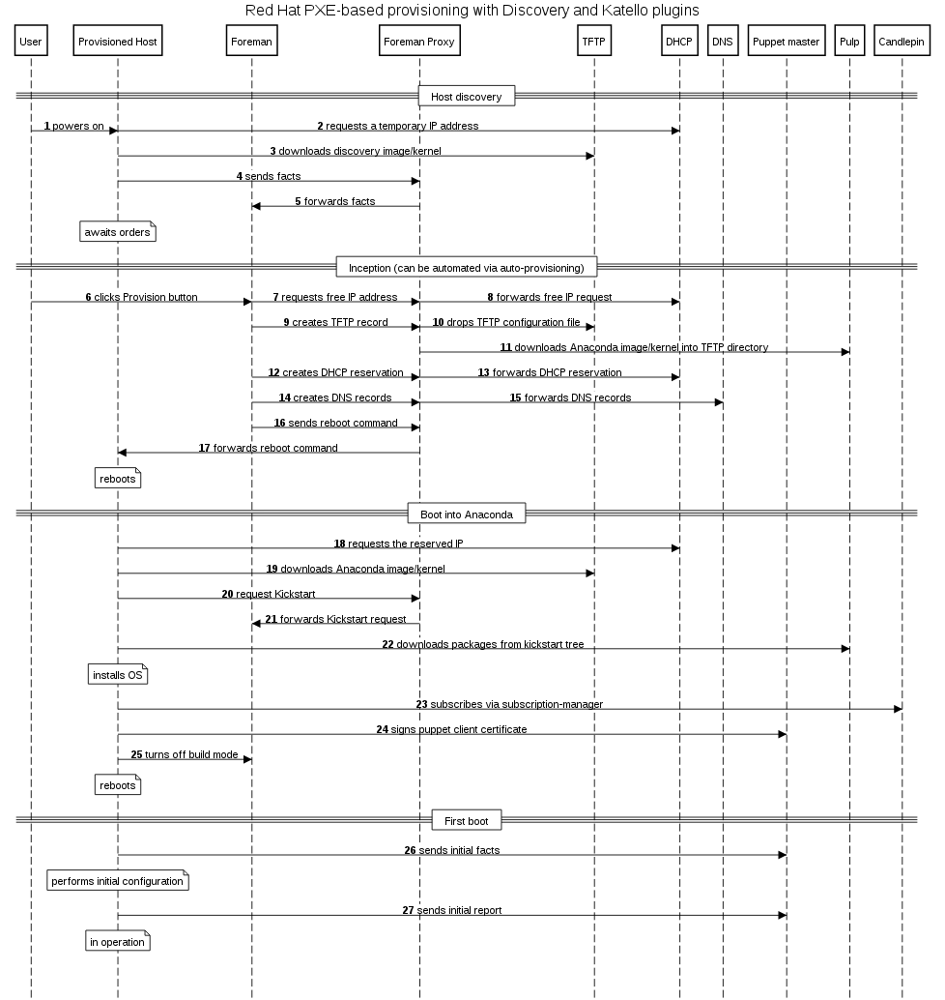

# Provisioning

See [the Foreman manual](http://theforeman.org/manuals/latest/index.html#4.4Provisioning) for general information on configuring provisioning.

## Templates

Katello ships a number of templates in addition to the standard Foreman ones. When using these templates, if a host has a Host group with an [Activation Key](../activation_keys/index.html), it will register as a Content Host automatically.

  - **Katello Kickstart Default** - Kickstart template for Fedora, CentOS, RHEL, and other Red Hat-compatible operating systems.
  - **Katello Kickstart Default Finish** - image-based provisioning
  - **Katello Kickstart Default User Data** - cloud-init template for EC2 and OpenStack
  - **subscription_manager_registration** - Snippet for registering a host for content

To customize any of the above templates, simply clone them and add your changes.

When you synchronize a repository with a distribution such as Fedora or CentOS, Katello will automatically create the operating system and assign these default templates.  You may change the defaults by going to Administer > Settings, and selecting the Katello tab.

## Workflow diagram

The diagram below shows Anaconda PXE-based provisioning with hardware
discovery and Katello content handling with Puppet Agent configuration. This
includes Katello and Discovery plugins and Red Hat Subscription Manager
interaction with Foreman/Pulp/Candlepin.

